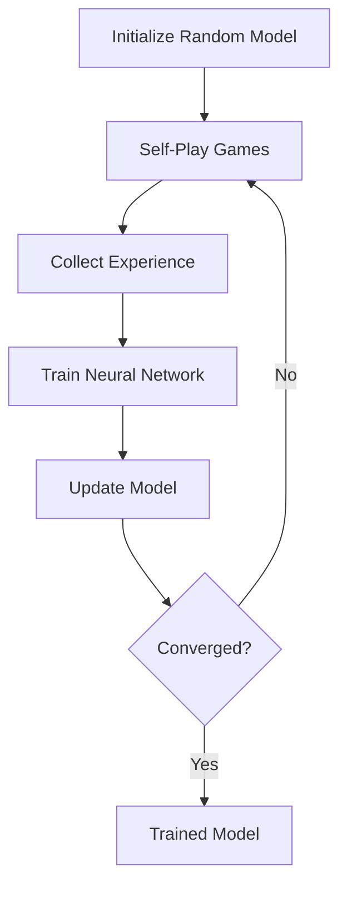

# Connect4 AlphaZero Training Documentation

## Executive Summary

This document provides comprehensive technical documentation for the Connect4 AlphaZero model trained in December 2025. The champion model (`model_120.pt`) achieved a 60% win rate in tournament play after 120 training iterations with critical bug fixes applied.

**Key Results:**
- **Champion Model**: `model_120.pt` (iteration 120)
- **Tournament Performance**: 30W-5D-15L (60% win rate, 95 points)
- **Training Duration**: ~24 hours on NVIDIA RTX 5080
- **Architecture**: ResNet-10 with 128 hidden units (~1.2M parameters)

---

## 1. AlphaZero Algorithm Overview

AlphaZero combines three key components to learn game strategy from self-play:

1. **Monte Carlo Tree Search (MCTS)**: Explores game tree using neural network guidance
2. **Deep Neural Network**: Evaluates positions and suggests moves
3. **Self-Play Training**: Learns by playing against itself repeatedly

### Training Loop



The training process follows these steps per iteration:

1. **Self-Play Generation**: Play 150 games using MCTS with current model
2. **Experience Collection**: Store (state, policy, outcome) tuples
3. **Neural Network Training**: 90 epochs of supervised learning
4. **Model Update**: Save checkpoint and repeat

---

## 2. Mathematical Foundation

### 2.1 PUCT Formula (MCTS Selection)

During tree search, child nodes are selected using the PUCT (Polynomial Upper Confidence Trees) formula:

$$
\text{UCB}(s, a) = Q(s, a) + c_{\text{puct}} \cdot P(s, a) \cdot \frac{\sqrt{N(s)}}{1 + N(s, a)}
$$

Where:
- $Q(s, a)$ = Average value of taking action $a$ from state $s$
- $P(s, a)$ = Prior probability from neural network policy
- $N(s)$ = Visit count of parent node
- $N(s, a)$ = Visit count of child node  
- $c_{\text{puct}}$ = Exploration constant (configured as 2.0)

**Critical Implementation Detail** (Bug Fix Dec 15, 2025):
```python
# Child value is from opponent's perspective, must negate for parent
q_child = child.value_sum / child.visit_count
q_parent = -q_child  # CRITICAL: perspective flip
u = C * child.prior * (sqrt(parent_visits) / (1 + child.visit_count))
return q_parent + u
```

### 2.2 Neural Network Loss Function

The model is trained using a combined loss:

$$
L = L_{\text{policy}} + \lambda \cdot L_{\text{value}}
$$

**Policy Loss** (Cross-Entropy):
$$
L_{\text{policy}} = -\sum_{a} \pi_{\text{MCTS}}(a) \cdot \log P_{\theta}(a|s)
$$

**Value Loss** (Mean Squared Error):
$$
L_{\text{value}} = \left(z - V_{\theta}(s)\right)^2
$$

Where:
- $\pi_{\text{MCTS}}(a)$ = Target policy from MCTS visit counts
- $P_{\theta}(a|s)$ = Neural network policy output
- $z$ = Game outcome (+1 win, 0 draw, -1 loss)
- $V_{\theta}(s)$ = Neural network value output
- $\lambda$ = Value loss weight (configured as 1.0)

### 2.3 Temperature-Based Action Selection

During self-play, actions are sampled with temperature:

$$
\pi'(a) = \frac{\pi(a)^{1/\tau}}{\sum_{a'} \pi(a')^{1/\tau}}
$$

Temperature schedule:
- Iterations 0-79: $\tau = 1.25$ (high exploration)
- Iterations 80-179: $\tau = 1.0$ (balanced)  
- Iterations 180+: $\tau = 0.75$ (more deterministic)

---

## 3. Neural Network Architecture

### 3.1 ResNet Architecture

The model uses a Residual Network architecture with:
- **Input**: 3-channel 6×7 board representation
- **Backbone**: 10 residual blocks with 128 filters
- **Dual Heads**: Policy head (7 actions) + Value head (scalar)

```
Input (3, 6, 7)
    ↓
Conv2D(3→128, 3×3) + BatchNorm + ReLU
    ↓
[ResBlock(128) × 10]  ← Backbone
    ↓
┌───────────────┬───────────────────┐
│ Policy Head   │  Value Head        │
│ Conv(128→32)  │  Conv(128→3)       │
│ BatchNorm     │  BatchNorm         │
│ ReLU          │  ReLU              │
│ Flatten       │  Flatten           │
│ Linear→7      │  Linear→1 + Tanh   │
└───────────────┴───────────────────┘
```

**Residual Block Structure**:
```python
def ResBlock(x):
    residual = x
    x = ReLU(BatchNorm(Conv2D(x)))  # First conv
    x = BatchNorm(Conv2D(x))         # Second conv
    x = x + residual                  # Skip connection
    return ReLU(x)
```

### 3.2 Input Encoding

States are encoded from the current player's perspective:

```python
def get_encoded_state(state, player):
    encoded = np.zeros((3, 6, 7), dtype=np.float32)
    encoded[0] = (state == player).astype(np.float32)   # Current player pieces
    encoded[1] = (state == -player).astype(np.float32)  # Opponent pieces  
    encoded[2] = (player == 1).astype(np.float32)       # Player indicator
    return encoded
```

**Critical Bug Fix** (Dec 15, 2025): Before this fix, Player -1's pieces were incorrectly encoded as "opponent" when they should be "current player", causing inverted learning.

### 3.3 Model Statistics

- **Total Parameters**: ~1.2M
- **Memory Footprint**: ~12MB per checkpoint
- **Inference Speed**: ~100ms per position (200 MCTS searches on RTX 5080)

---

## 4. MCTS Implementation

### 4.1 Search Algorithm

```python
def search(state, num_searches=200):
    root = Node(state)
    
    for _ in range(num_searches):
        node = root
        
        # 1. Selection: Traverse tree using PUCT
        while node.is_fully_expanded():
            node = select_child_with_max_ucb(node)
        
        # 2. Expansion: Add children with network priors
        if not node.is_terminal():
            policy, value = network(node.state)
            node.expand(policy)
        else:
            value = node.terminal_value
        
        # 3. Backpropagation: Update visit counts and values
        backpropagate(node, value)
    
    # Return visit count distribution as policy
    return visit_counts_to_policy(root)
```

### 4.2 Key Implementation Details

**Dirichlet Noise** (Root Exploration):
```python
# Add exploration noise only at root node
if node == root:
    noise = np.random.dirichlet([α] * num_actions)  # α = 0.3
    policy = (1 - ε) * policy + ε * noise            # ε = 0.25
```

**Batch Size**: Configured as 1 to avoid shallow-tree artifacts:
- Higher batch sizes (>1) can cause duplicate leaf evaluations
- Connect4 tactics require deep search, batch=1 ensures proper tree depth

### 4.3 Perspective Handling

**Critical**: All values must be properly flipped between parent/child perspectives:

1. **Expansion**: Check terminal BEFORE perspective flip
2. **UCB**: Negate child Q-value when computing parent UCB
3. **Backpropagation**: Flip value at each level

```python
# Correct implementation
child_state = get_next_state(state, action, player=1)
terminal_value, is_terminal = check_terminal(child_state)  # Before flip!
child_state = change_perspective(child_state, player=-1)   # Now flip
if is_terminal:
    terminal_value = -terminal_value  # Flip for opponent's view
```

---

## 5. Training Process

### 5.1 Hyperparameters

| Parameter | Value | Description |
|-----------|-------|-------------|
| **Iterations** | 127 | Total training iterations |
| **Self-Play Games** | 150 | Games per iteration |
| **Training Epochs** | 90 | Epochs per iteration |
| **Batch Size** | 512 | Training batch size |
| **Learning Rate** | 0.001 | Adam optimizer |
| **Weight Decay** | 0.0001 | L2 regularization |
| **MCTS Searches** | 100 | Searches per move |
| **$c_{\text{puct}}$** | 2.0 | Exploration constant |
|**Dirichlet α** | 0.3 | Noise concentration |
| **Dirichlet ε** | 0.25 | Noise fraction |

### 5.2 Training Schedule

**Bootstrap Phase** (Iterations 0-9):
- 92% Self-play vs self
- 8% vs Random opponent
- Purpose: Learn basic valid moves

**Main Phase** (Iterations 10+):
- 98.5% Pure self-play
- 1% vs Aggressive opponent (creates threats)
- 0.5% vs Strong 2-ply opponent

**Temperature Schedule**:
| Iteration Range | Temperature |
|----------------|-------------|
| 0-79 | 1.25 |
| 80-179 | 1.0 |
| 180+ | 0.75 |

### 5.3 Computational Requirements

- **Hardware**: NVIDIA RTX 5080 (16GB VRAM)
- **Training Time**: ~12-15 minutes per iteration
- **Total Time**: ~24-32 hours for 127 iterations
- **Disk Space**: ~3GB for all checkpoints

---

## 6. Critical Bug Fixes (December 14-15, 2025)

### 6.1 Player Perspective Encoding (commit `3eda357`)

**Problem**: States stored in neutral perspective but encoded without conversion.

**Impact**: Player -1's pieces encoded as "opponent" → model learned inverted patterns → win rate collapsed to 1-3%.

**Fix**:
```python
# BEFORE (broken)
worker_memory.append((
    game.get_encoded_state(hist_state),  # Wrong! State is neutral
    hist_probs,
    hist_outcome
))

# AFTER (fixed)
state_from_player_perspective = game.change_perspective(hist_state, hist_player)
worker_memory.append((
    game.get_encoded_state(state_from_player_perspective),  # Correct!
    hist_probs,
    hist_outcome
))
```

### 6.2 UCB Q-Term Sign (commit `1b728e3`)

**Problem**: Child Q-values not negated for parent perspective.

**Impact**: MCTS optimized opponent's position instead of own → no learning after 200 iterations.

**Fix**:
```python
# BEFORE (broken)
q_parent = child.value_sum / child.visit_count  # Wrong perspective!

# AFTER (fixed)  
q_child = child.value_sum / child.visit_count
q_parent = -q_child  # CRITICAL: negate for parent's perspective
```

### 6.3 Duplicate Sample Bug (commit `1b728e3`)

**Problem**: `memory.extend()` called twice, doubling all training samples.

**Impact**: 2× bias amplification, distorted learning signal.

**Fix**: Removed duplicate `memory.extend()` call.

### 6.4 MCTS Batching (commit `1b728e3`)

**Problem**: batch_size >1 caused stale tree updates.

**Impact**: Destroyed search depth, shallow tactical play.

**Fix**: Set default `mcts_batch_size=1` for tactical games.

---

## 7. Evaluation & Tournament Results

### 7.1 Tournament Setup

**Configuration**:
- **Models Tested**: 100, 110, 114, 120, 125, 127
- **Format**: Round-robin (all vs all)
- **Games per Matchup**: 10 (5 as Player 1, 5 as Player 2)
- **MCTS Searches**: 100 per move
- **Scoring**: Win=3pts, Draw=1pt, Loss=0pts

### 7.2 Final Standings

| Rank | Model | W | D | L | Points | Win% |
|------|-------|---|---|---|--------|------|
| 🥇 1 | **model_120** | **30** | 5 | 15 | **95** | **60%** |
| 🥈 2 | model_127 | 30 | 0 | 20 | 90 | 60% |
| 🥉 3 | model_114 | 20 | 5 | 25 | 65 | 40% |
| 4 | model_110 | 15 | 15 | 20 | 60 | 30% |
| 5 | model_125 | 15 | 15 | 20 | 60 | 30% |
| 6 | model_100 | 15 | 10 | 25 | 55 | 30% |

### 7.3 Key Insights

1. **model_120 Champion**: Best balanced performance with 5 draws showing tactical stability
2. **model_127 Aggressive**: Same wins but no draws suggests high-variance play
3. **model_125 Anomaly**: Dominated model_127 (10-0 sweep) despite lower overall rank
4. **First-Player Advantage**: Models showed ~55-60% win rate as Player 1

### 7.4 Model Progression

Observation from git history:
- **Iterations 0-20**: Learning basic tactics (block threats, connect pieces)
- **Iterations 20-80**: Developing opening theory and mid-game patterns
- **Iterations 80-114**: Refining endgame and tactical combinations
- **Iterations 115-127**: Potential overfitting or local optima

**Recommendation**: Use `model_120.pt` as it represents peak performance before potential overfitting in later iterations.

---

## 8. Usage Examples

### 8.1 Loading the Model

```python
import torch
from alpha_zero_light.game.connect_four import ConnectFour
from alpha_zero_light.model.network import ResNet
from alpha_zero_light.mcts.mcts import MCTS

# Initialize
game = ConnectFour()
device = torch.device("cuda" if torch.cuda.is_available() else "cpu")

# Load model
model = ResNet(game, num_res_blocks=10, num_hidden=128).to(device)
model.load_state_dict(torch.load("model_120.pt", map_location=device))
model.eval()

# Create MCTS
args = {'C': 2.0, 'num_searches': 200}
mcts = MCTS(game, args, model)
```

### 8.2 Getting Move from Position

```python
import numpy as np

# Setup position (empty board)
state = np.zeros((6, 7), dtype=np.float32)

# Get move probabilities
action_probs = mcts.search(state)

# Select best move
best_action = np.argmax(action_probs)
print(f"Best move: column {best_action}")
print(f"Move probabilities: {action_probs}")
```

### 8.3 Playing a Game

```python
def play_game(mcts1, mcts2):
    state = game.get_initial_state()
    player = 1
    
    while True:
        # Get move from current player's MCTS
        mcts = mcts1 if player == 1 else mcts2
        ai_state = game.change_perspective(state, player)
        action_probs = mcts.search(ai_state)
        action = np.argmax(action_probs)
        
        # Make move
        state = game.get_next_state(state, action, player)
        
        # Check terminal
        value, is_terminal = game.get_value_and_terminated(state, action)
        if is_terminal:
            return value if player == 1 else -value
        
        player = game.get_opponent(player)
```

---

## 9. Performance Optimizations

### 9.1 GPU Utilization

- **Batch Inference**: Process multiple leaf nodes together
- **Memory Management**: Keep model on GPU, batch states efficiently
- **Tensor Operations**: Use PyTorch tensors throughout pipeline

### 9.2 MCTS Optimizations

1. **Early Termination**: Cache terminal states, skip evaluation
2. **Minimum Priors**: Force $P(a) \geq 10^{-8}$ for UCB exploration
3. **Tie-Breaking**: Random selection among equal UCB to avoid artifacts

### 9.3 Training Optimizations

- **Mixed Precision**: Could enable for faster training (not implemented)
- **Parallel Self-Play**: Multi-core CPU for game generation
- **Checkpoint Pruning**: Keep only every 10th model to save disk

---

## 10. Future Improvements

### 10.1 Architecture Enhancements

- **Attention Mechanisms**: Add self-attention layers
- **Larger Models**: Scale to ResNet-20 with 256 hidden units
- **Value Head Improvements**: Auxiliary outcome prediction tasks

### 10.2 Training Enhancements

- **Curriculum Learning**: Graduated difficulty from 3-in-a-row to 4-in-a-row
- **Opponent Diversity**: Mix in previous checkpoint versions
- **Loss Weighting**: Dynamic adjustment based on value prediction accuracy

### 10.3 MCTS Enhancements

- **Virtual Loss**: Enable batching safely with virtual loss counts
- **Progressive Widening**: Expand nodes gradually based on visits
- **UCB Variants**: Try AlphaGo Zero's improved PUCT formula

---

## 11. References

### Papers
- Silver et al. (2017). "Mastering Chess and Shogi by Self-Play with a General Reinforcement Learning Algorithm" (AlphaZero)
- Silver et al. (2016). "Mastering the game of Go with deep neural networks and tree search" (AlphaGo)
- Browne et al. (2012). "A Survey of Monte Carlo Tree Search Methods"

### Implementation
- Git Repository: `/mnt/ssd2pro/alpha-zero-light` (branch: `4inarow`)
- Champion Model: `/mnt/ssd2pro/alpha-zero-checkpoints/connect4/model_120.pt`
- Configuration: `src/alpha_zero_light/config_connect4.py`

### Critical Commits
- `3eda357`: Player perspective encoding fix (Dec 15, 2025)
- `1b728e3`: UCB Q-term sign + batching + duplicate sample fixes (Dec 15, 2025)
- `a1eea41`: Connect4 improvements and evaluation tools (Dec 19, 2025)

---

## Appendix A: Configuration File

```python
# src/alpha_zero_light/config_connect4.py
TRAINING_CONFIG = {
    'num_iterations': 350,
    'num_self_play_iterations': 150,
    'num_epochs': 90,
    'batch_size': 512,
    'temperature_schedule': [
        {'until_iteration': 80, 'temperature': 1.25},
        {'until_iteration': 180, 'temperature': 1.0},
        {'until_iteration': 350, 'temperature': 0.75}
    ],
}

MCTS_CONFIG = {
    'C': 2.0,
    'num_searches': 100,
    'dirichlet_alpha': 0.3,
    'dirichlet_epsilon': 0.25,
    'mcts_batch_size': 1,
}

MODEL_CONFIG = {
    'num_res_blocks': 10,
    'num_hidden': 128,
    'learning_rate': 0.001,
    'weight_decay': 0.0001,
}
```

---

**Document Version**: 1.0  
**Last Updated**: January 11, 2026  
**Author**: AlphaZero Light Training Documentation  
**Champion Model**: model_120.pt (60% tournament win rate)
